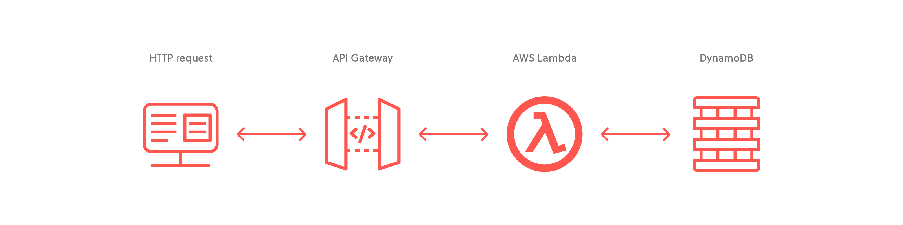

# ALX Cloud Development:  Final-project

In this project, I will develop and deploy a simple "TODO" application using AWS Lambda and the Serverless framework. This application will allow me to create, remove, update, and get TODO items.


Each TODO item will contain the following fields:
- `todoId` (string): a unique ID for an item.
- `createdAt` (string): the date and time when an item was created.
- `name` (string): the name of a TODO item (e.g. "Change a light bulb").
- `dueDate` (string): the date and time by which an item should be completed.
- `done` (boolean): true if an item was completed, false otherwise.
- `attachmentUrl` (string) (optional): a URL pointing to an image attached to a TODO item.

I might also store an ID of the user who created a TODO item. Each TODO item can optionally have an attachment image, and I will ensure that each user only has access to the TODO items they have created.

### `Getting Started:`

```bash
        JSON Web Key Set: https://dev-Something.us.auth0.com/.well-known/jwks.json

        npm install -g serverless

        serverless --version

        serverless login

        rm -rf node_modules (deleting node_modules)

        sls config credentials --provider aws --key Access_ID --secret Access_Key --profile serverless -o
```

### `Deploy Backend:`

```bash
        cd backend

        export NODE_OPTIONS=--openssl-legacy-provider (For latest node users)

        npm install

        npm install --save-dev serverless-iam-roles-per-function@next

        npm audit fix

        serverless

        serverless deploy --verbose

        sls deploy -v --aws-profile serverless (For permissions error)

        npm i typescript@4.6.4 (typescript erros)
```

### `Deploy Frontend:`

```bash
        cd client

        npm install

        npm install --save-dev

        npm run start
```

### Edit the config.ts file in the client folder under the src sub folder:

```typescript
        const apiId = '...' API Gateway id
        export const apiEndpoint = `https://${apiId}.execute-api.us-east-2.amazonaws.com/dev`

        export const authConfig = {
                domain: '...',    // Domain from Auth0
                clientId: '...',  // Client id from an Auth0 application
                callbackUrl: 'http://localhost:3000/callback'
        }
```

---

<p align=center>THE END, THANK YOU<p>

---
---